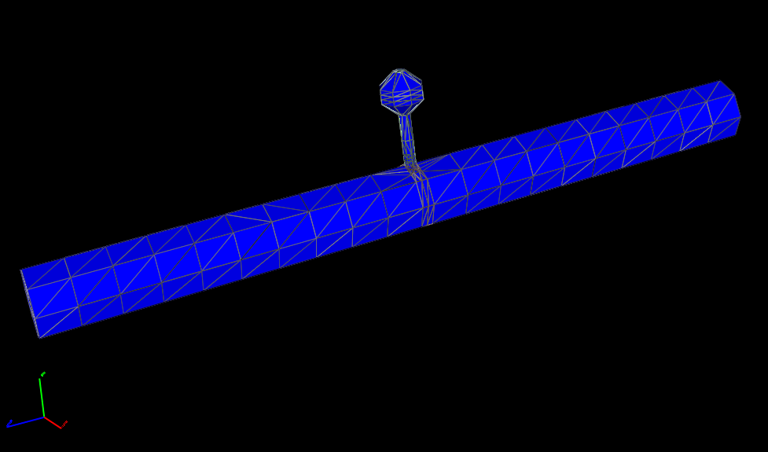
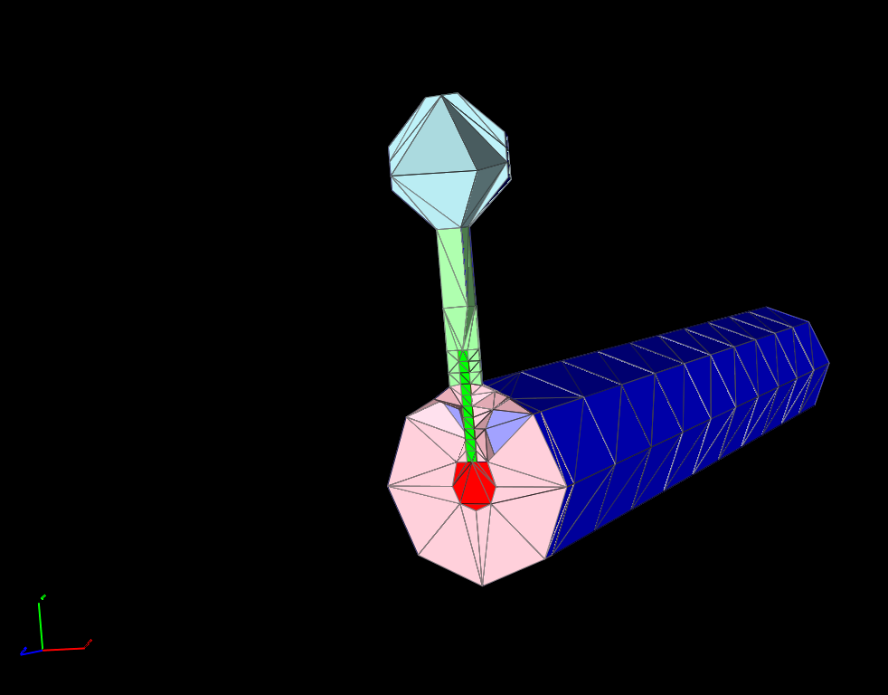
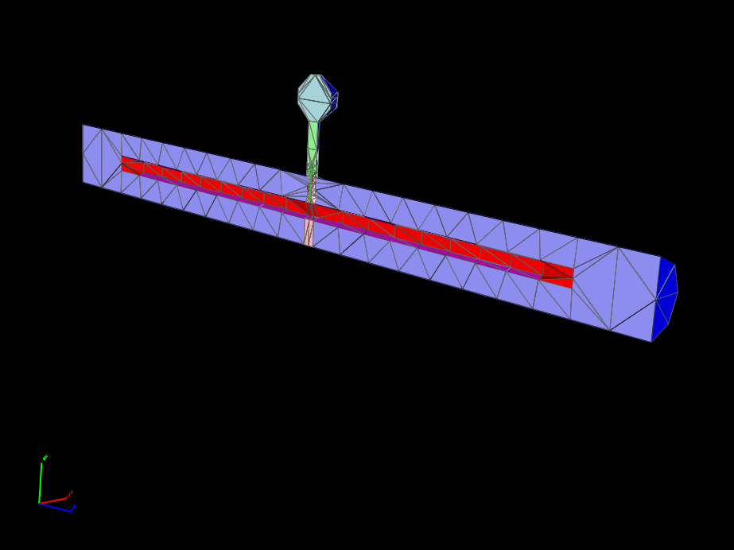
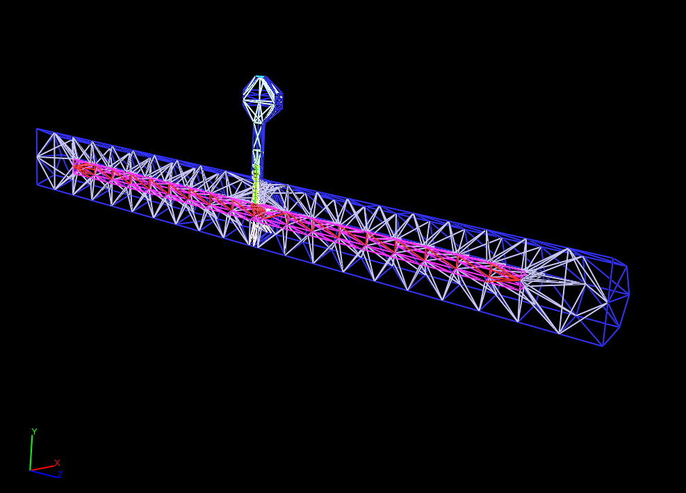
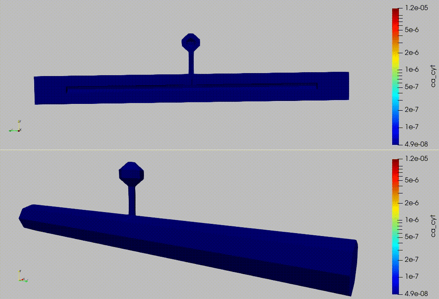
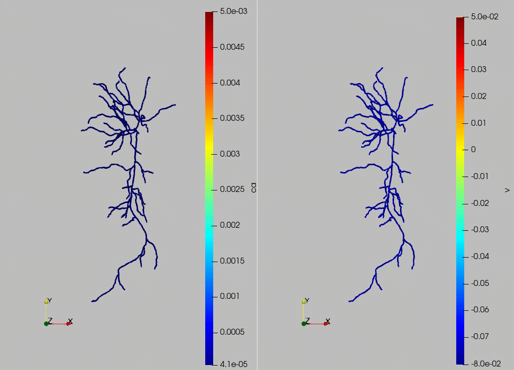
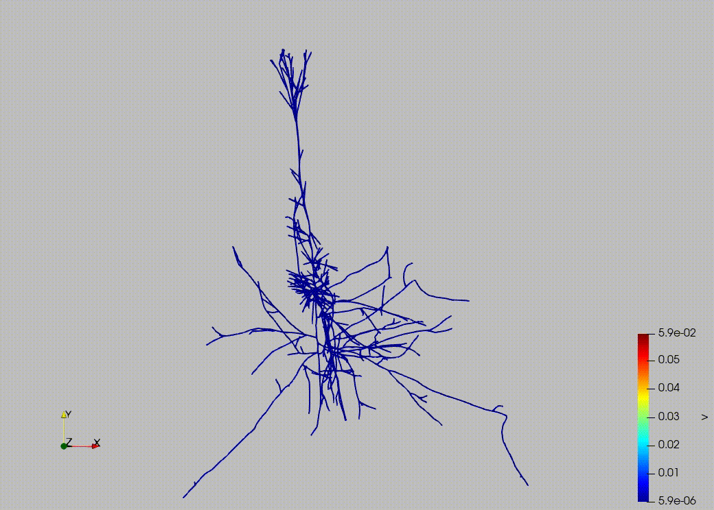
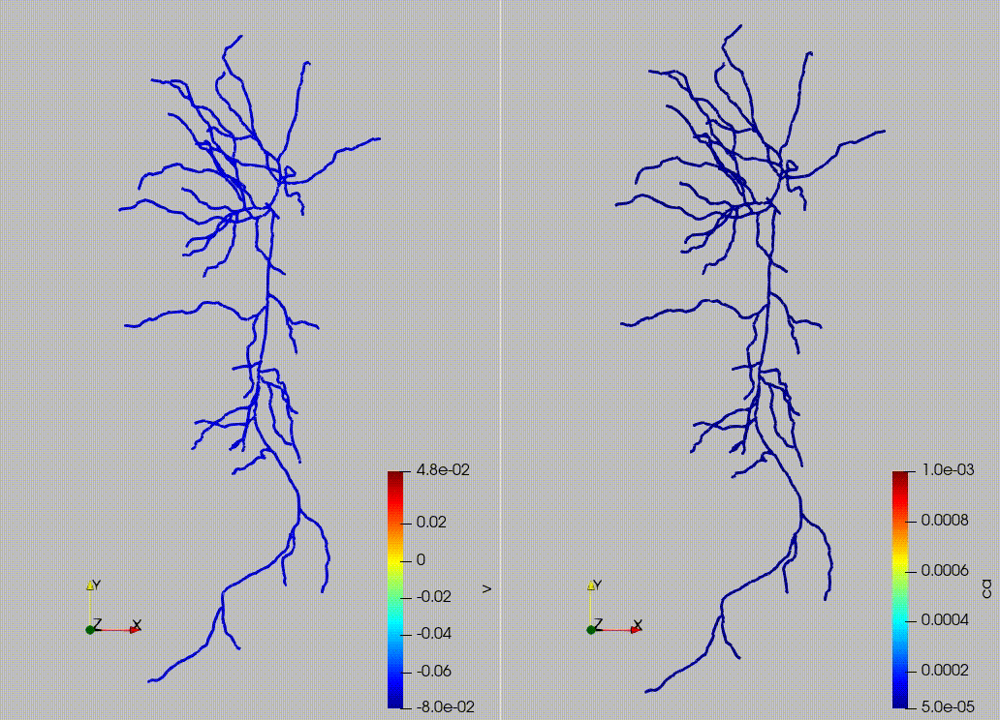

# ug4Projects
This is where I keep my ug4 project codes and explorations. Below are the specifications of the version of `ughub`
I recommending cloning ug4/ughub to your `ROOT` directory and building ug4 there.

```
📂 Repository Information for ../ughub
-----------------------------------------
Commit Hash:        2143e0d7d900a98f4e997d610062758b626d783d
Version Tag:        v2021.amfs
Creation Date:      2015-10-22 11:33:39 +0200
Last Modified:      2024-06-05 08:08:21 +0200
Total Commits:      87
```

I have provided a simple shell script `repo_info.sh` which will print the above information for a repo. Its usage is below

```
./repo_info.sh /path/to/repository
```
Below are some sample images for the geometry generated in the  `gen_spine.lua` script:

<div align="center">
<table>
  <tr>
    <td align="center">
      <br/>
      <sub>Artificial Spine</sub>
    </td>
    <td align="center">
      <br/>
      <sub>Artificial Spine Sliced</sub>
    </td>
  </tr>
  <tr>
    <td align="center">
      <br/>
      <sub>Artificial Spine Sliced</sub>
    </td>
    <td align="center">
      <br/>
      <sub>Wire frame geometry</sub>
    </td>
  </tr>
</table>
</div>

Here is a video of a Calcium simulation on an artificial spine, includes cytosol and ER calcium dynamics

<div align="center">
 <br/>
 <sub> Calcium Dynamics Simulation (3D)</sub>
</div>


Here is also a video of a coupled Calcium and Voltage dynamics simulation
<div align="center">
 <br/>
 <sub> Coupled Calcium and Voltage Simulations (1D)</sub>
</div>

Below is a video of an electrical dynamics simulation on a pyramidal cell
<div align="center">
 <br/>
 <sub> Voltage Simulations (1D)</sub>
</div>

Below is a video of a coupled ion and electrical dynamics simulation on a 1d cell geometry
<div align="center">
 <br/>
 <sub> Voltage and Ion Coupled Simulation (1D)</sub>
</div>

## File Structure
I have also provided the file structure for my main folder, the main folder contains this repository and `ug4` and `ughub`, the latter two you will need to build separately, by following the directions on the gitHub page for ug4

```
├── ug4
│   ├── .ughub
│   ├── CMakeLists.txt
│   ├── apps
│   ├── bin
│   ├── build
│   ├── externals
│   ├── lib
│   ├── plugins
│   ├── tools
│   └── ugcore
├── ug4Projects
│   ├── LICENSE
│   ├── README.md
│   ├── docs
│   ├── images
│   ├── projects
│   └── repo_info.sh
└── ughub
    ├── .gitignore
    ├── LICENSE
    ├── README.md
    ├── __pycache__
    ├── autocompletions
    ├── docu
    ├── project_templates
    ├── ughub
    ├── ughub.bat
    ├── ughub.py
    ├── ughubHelp.py
    ├── ughubHelpContents.py
    ├── ughubProjectFileGenerator.py
    └── ughubUtil.py
```

You can get the above tree by executing
```
tree -a -L 2 -I '.git|CMake.*'
```

## Install of `ug4` and `ughub`
Please follow the steps for installing `ughub` via the github page for ug4. A few things to note because my installation will most likely be different from yours, but below are some of the notes I have for my installation...
- you will need to execute inside the `ug4` folder
```
../path/to/ughub/ughub init
```
- then execute inside `ug4`
```
../path/to/ughub/ughub install Examples
```
- you will need to make a `build` directory and then `cd` in to it. Once inside the `build` directory execute
```
cmake -DDEBUG=ON -DPARALLEL=OFF -DCMAKE_BUILD_TYPE=Debug -DUSER_LAPACK_LIBRARIES=/usr/lib/x86_64-linux-gnu/lapack/liblapack.so -DUSER_BLAS_LIBRARIES=/usr/lib/x86_64-linux-gnu/libblas.so -DConvectionDiffusion=ON ..
```
- then execute `make -j2`
- the above steps will build `ugshell` inside `ug4/bin/` folder

## Switching to `mpi` compilers
If you want to use the `mpi` compilers (should already be part of your Linux OS), then inside `build`
```
cmake -DCMAKE_C_COMPILER=/usr/bin/mpicc -DCMAKE_CXX_COMPILER=/usr/bin/mpicxx ..
```

## Add ProMesh Plugin
Inside the `build` folder execute
```
cmake -DProMesh=ON .. && make -j2
```
I plan on using ProMesh features in my explorations, ProMesh has several levels of functionality.

## Add Neuron Plugins
I am also using codes developed by my gradute school colleagues and doctoral advisor, to include them we execute in `ug4` folder
```
../path/to/ughub/ughub addsource neurobox https://github.com/NeuroBox3D/neurobox-packages.git
```
then execute
```
../path/to/ughub/ughub install neuro_collection cable_neuron
```
this will install two of the projects to the to ug4 build
next go back into `build` and execute
```
cmake -Dneuro_collection=ON -Dcable_neuron=ON .. && make -j2
```

## Add Tetgen Plugin
I also wanted to use the tetrahedralize features of ug4, to build that plugin you need to execute:
```
cmake -Dtetgen=ON -DLINK_TETGEN=ON ..
```
**Note** If you are building `neuron_collection` there appears to be an error with the `tetrahedralize` test, the error may look like below
```
/root/ug4/plugins/neuro_collection/test/tetrahedralize_util.cpp: In function ‘bool ug::neuro_collection::Tetrahedralize(ug::Selector&, ug::Grid&, ug::ISubsetHandler*, number, bool, bool, ug::APosition&, int)’:
/root/ug4/plugins/neuro_collection/test/tetrahedralize_util.cpp:181:56: error: cannot convert ‘char*’ to ‘tetgenbehavior*’
  181 |                                         tetrahedralize(const_cast<char*>(ss.str().c_str()), &in, &out);
      |                                                        ^~~~~~~~~~~~~~~~~~~~~~~~~~~~~~~~~~~
      |                                                        |
      |                                                        char*
In file included from /root/ug4/plugins/neuro_collection/test/tetrahedralize_util.cpp:46:
/root/ug4/tools/tetgen/tetgen.h:2233:37: note:   initializing argument 1 of ‘void tetrahedralize(tetgenbehavior*, tetgenio*, tetgenio*, tetgenio*, tetgenio*)’
 2233 | void tetrahedralize(tetgenbehavior *b, tetgenio *in, tetgenio *out,
      |                     ~~~~~~~~~~~~~~~~^
make[2]: *** [ugcore/plugins/neuro_collection/CMakeFiles/neuro_collection.dir/build.make:622: ugcore/plugins/neuro_collection/CMakeFiles/neuro_collection.dir/test/tetrahedralize_util.cpp.o] Error 1
make[2]: *** Waiting for unfinished jobs....
make[1]: *** [CMakeFiles/Makefile2:580: ugcore/plugins/neuro_collection/CMakeFiles/neuro_collection.dir/all] Error 2
make: *** [Makefile:156: all] Error 2
```
You can disregard this error, `tetgen` execuate is still built in `bin` folder.
**NOTE** - If you plan on using `tetrahedralize` then you will need to comment out the line that the error is referencing, I tried this and it appears to work now.

## Add SuperLU Plugin
To use superlu you will need to execute in the root directory of your `ug4` installation
```
../ughub/ughub install SuperLU6
```
this will install the plugin folder `SuperLU6`, you will need to go into that directory, then navigate to `external` sub folder and then execute
```
git clone https://github.com/xiaoyeli/superlu.git
```
which will clone the superlu repo. **Note** `external` already contains `superlu` folder, just delete that folder.
For superlu you will need to execute in the `build` directory
```
cmake -DSuperLU6=ON .. && make -j2
```

## Add ParMetis Plugin
I also use ParMetis with some of my `.lua` scripts, it is a little tricky, I have include a `Parmetis.tar` which needs to be extracted. Drop the root directory of Parmetis into `ug4/plugins/` folder.

Go back into build and execute
```
cmake -DParmetis=ON -DPARALLEL=ON -DDEBUG=OFF -DPCL_DEBUG_BARRIER=ON .. && make -j2
```
I turned off `DEBUG` because I noticed error would arise, and to use Parmetis you need `PARALLEL` on.
